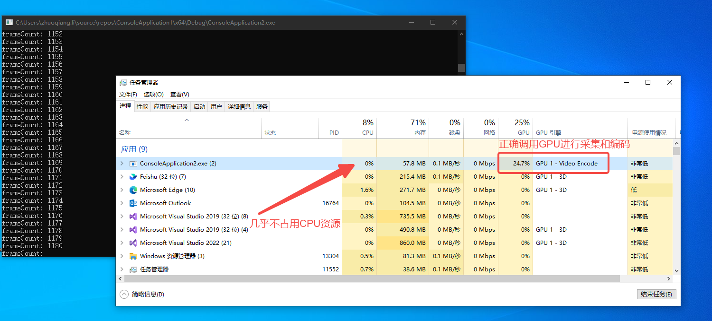

本文介绍一种基于Windows桌面复制API和FFMPEG的高性能桌面流捕获方法，其特点在于屏幕捕获和视频编码全部在GPU上进行，与传统的基于GDI的方式相比，效率更高且不占用CPU资源。该方法可用于桌面录制、远程桌面软件等。

<!--truncate-->

# Windows桌面复制API
Windows桌面复制API是Windows8开始支持的一套新的API，提供对桌面映像的远程访问能力。该API直接在DXGI图面中接收桌面的更新（底层显示设备），因此性能极高。经测试，**利用该API可实现200FPS以上的桌面图像捕获，作为对比，传统的GDI捕获最高只能达到30FPS。**

# FFMPEG编码器
FFMPEG支持使用硬件编码器，NVDIA显卡可以使用`nvenc`，AMD显卡可以使用`amf`。本文中实现的关键在于如何将DXGI输出的数据**直接送入硬件编码器，避免显存与内存间不必要的拷贝**。

# 核心实现
## 在FFMPEG中创建D3D11对象
DXGI的桌面捕获依赖D3D11，为了能够将捕获到的数据直接交给FFMPEG的硬编码器处理，必须使用FFMPEG创建D3D11设备对象，而不能我们自己创建（因为不同D3D11对象的数据不能直接调用），代码如下（省略异常处理）：

``` cpp
    int ret = 0;
    AVBufferRef* device_ref = NULL;
    ret = av_hwdevice_ctx_create(&device_ref, AV_HWDEVICE_TYPE_D3D11VA, NULL, NULL, 0);
    ret = av_hwdevice_ctx_init(device_ref);

    AVHWDeviceContext* hw_device_ctx = (AVHWDeviceContext*)device_ref->data;
    AVD3D11VADeviceContext* hw_d3d_ctx = (AVD3D11VADeviceContext*)hw_device_ctx->hwctx;

    ID3D11DeviceContext* pD3dDeviceContext = hw_d3d_ctx->device_context;
    ID3D11Device* pD3dDevice = hw_d3d_ctx->device;
```

`pD3dDevice`和`pD3dDeviceContext`为获取到的D3D11的对象，将利用它们进行屏幕捕获。

## DXGI屏幕捕获
获取到D3D对象后，进一步获取DXGI相关对象：

``` cpp
    IDXGIDevice* pDxgiDevice;
    pD3dDevice->QueryInterface(IID_PPV_ARGS(&pDxgiDevice));

    IDXGIAdapter* pDxgiAdapter;
    hr = pDxgiDevice->GetParent(IID_PPV_ARGS(&pDxgiAdapter));

    UINT i = 0;
    IDXGIOutput* pOutput;
    std::vector<IDXGIOutput*> vOutputs;
    while (pDxgiAdapter->EnumOutputs(i, &pOutput) != DXGI_ERROR_NOT_FOUND)
    {
        vOutputs.push_back(pOutput);
        ++i;
    }

    IDXGIOutput1* pDxgiOutput1;
    vOutputs[0]->QueryInterface(IID_PPV_ARGS(&pDxgiOutput1));

    IDXGIOutputDuplication* pDxgiOutputDuplication;
    pDxgiOutput1->DuplicateOutput(pD3dDevice, &pDxgiOutputDuplication);

    DXGI_OUTDUPL_DESC mDxgiOutDupDesc;
    pDxgiOutputDuplication->GetDesc(&mDxgiOutDupDesc);

    std::cout << mDxgiOutDupDesc.ModeDesc.Width << "x";
    std::cout << mDxgiOutDupDesc.ModeDesc.Height << "@";
    std::cout << mDxgiOutDupDesc.ModeDesc.RefreshRate.Numerator / mDxgiOutDupDesc.ModeDesc.RefreshRate.Denominator << "Hz" << std::endl;
```

`vOutputs`中存放的是所有显示器信息，初始化时用了`vOutputs[0]`，表示第一个显示器。`pDxgiOutputDuplication`对象可用于获取屏幕，通过调用`AcquireNextFrame`方法。该方法返回一个`IDXGIResource`对象，可通过下列代码从该Resource中获取到包含桌面图像数据的`ID3D112DTexture`对象：

``` cpp
    ID3D11Texture2D* pAcquiredDesktopImage;
    hr = pDxgiOutputDuplication->AcquireNextFrame(1, &mFrameInfo, &pDesktopRes);
    if (SUCCEEDED(hr))
    {
        pDesktopRes->QueryInterface(IID_PPV_ARGS(&pAcquiredDesktopImage));
        pDesktopRes->Release();
    }
```

获取到的`pAcquiredDesktopImage`为D3D的二维纹理对象，内部的图片数据存在于显存中，格式为`BGRA`。

## 创建FFMPEG硬件编码器
FFMPEG编码器的默认实现是软件实现，编码时占用CPU资源。根据平台不同，可以创建对应的硬件编码器，并进行相应配置：

``` cpp
    // 创建并配置硬件编码器
    const AVCodec* codec = avcodec_find_encoder_by_name("h264_nvenc");   // NVDIA平台
    // const AVCodec* codec = avcodec_find_encoder_by_name("h264_amf");  // AMD平台
    AVCodecContext* codec_ctx = avcodec_alloc_context3(codec);

    const int TARGET_FPS = 60;

    codec_ctx->width = 1920;
    codec_ctx->height = 1080;
    codec_ctx->pix_fmt = AV_PIX_FMT_D3D11;
    codec_ctx->time_base = AVRational{ 1, TARGET_FPS };
    codec_ctx->framerate = AVRational{ TARGET_FPS, 1 };
    codec_ctx->sample_aspect_ratio = AVRational{ 1, 1 }; 
    codec_ctx->gop_size = 10;
    codec_ctx->max_b_frames = 1;
```
需要注意的是`pix_fmt`参数，此处应选择`AV_PIX_FMT_D3D11`，这样FFMPEG就会使用D3D11在GPU中创建帧缓存，而不是在内存中。这一步很重要，由于DDA采集到的帧是D3D资源，存在显存中，而底层硬件编码器的帧缓存也在显存中，如果FFMPEG的帧缓存分配在内存中，编码时就会产生 `显存->内存->显存`的拷贝，而内存和显存之间的拷贝消耗CPU资源，且会降低性能。而如果使用显存内帧缓存，则所有的拷贝操作都在显存内完成，则完全不会占用CPU资源，性能极高。

## 创建桌面帧缓存和FFPMEG编码器帧缓存
DDA有一个特性，当桌面不发生变化时捕获不到画面，也就是只有桌面变化才能获取到新的帧。而视频编码器要求每一帧连续输入，因此我们创建一个桌面帧缓存，当桌面不变时直接使用缓存的帧输入编码器。同样，我们在GPU中分配来避免内存和显存间的拷贝。

``` cpp
    D3D11_TEXTURE2D_DESC resDesc;
    ZeroMemory(&resDesc, sizeof(D3D11_TEXTURE2D_DESC));
    resDesc.Width = 1920;
    resDesc.Height = 1080;
    resDesc.MipLevels = 1;
    resDesc.ArraySize = 1;
    resDesc.Format = DXGI_FORMAT_B8G8R8A8_UNORM;
    resDesc.SampleDesc.Count = 1;
    resDesc.Usage = D3D11_USAGE_DEFAULT;
    resDesc.BindFlags = D3D11_BIND_RENDER_TARGET;
    resDesc.CPUAccessFlags = 0;

    ID3D11Texture2D* pCaptureBuffer;
    pD3dDevice->CreateTexture2D(&resDesc, NULL, &pCaptureBuffer);
```

接下来为FFMPEG分配帧缓存， 并打开编码器：

``` cpp
    AVBufferRef* hw_frames_ref;
    AVHWFramesContext* frame_ctx = NULL;

    hw_frames_ref = av_hwframe_ctx_alloc(device_ref);
    frame_ctx = (AVHWFramesContext*)(hw_frames_ref->data);
    frame_ctx->format = AV_PIX_FMT_D3D11;
    frame_ctx->sw_format = AV_PIX_FMT_BGRA;
    frame_ctx->width = 1920;
    frame_ctx->height = 1080;
    frame_ctx->initial_pool_size = 20;

    ret = av_hwframe_ctx_init(hw_frames_ref);
    codec_ctx->hw_frames_ctx = av_buffer_ref(hw_frames_ref);
    av_buffer_unref(&hw_frames_ref);
    ret = avcodec_open2(codec_ctx, codec, NULL);
```

## 循环编码并写入文件流
以下代码创建输出文件流、写入文件头、循环编码并写入文件、写入文件尾：

``` cpp
    int64_t calc_duration = av_q2d(codec_ctx->time_base) / av_q2d(vst->time_base);
    int64_t frame_duration = av_q2d(codec_ctx->time_base) * 1000000;
    int64_t last_frame_time = av_gettime();

    while (frameCount <= RECORD_PERIOD * TARGET_FPS)
    {
        last_frame_time = av_gettime();
        hr = pDxgiOutputDuplication->AcquireNextFrame(1, &mFrameInfo, &pDesktopRes);

        if (SUCCEEDED(hr))
        {
            pDesktopRes->QueryInterface(IID_PPV_ARGS(&pAcquiredDesktopImage));
            pDesktopRes->Release();

            pD3dDeviceContext->CopyResource(pCaptureBuffer, pAcquiredDesktopImage);

            pAcquiredDesktopImage->Release();
            pDxgiOutputDuplication->ReleaseFrame();
        }

        AVFrame* hw_frame = av_frame_alloc();
        ret = av_hwframe_get_buffer(codec_ctx->hw_frames_ctx, hw_frame, 0);
        if (ret < 0)
        {
            return ret;
        }
        if (!hw_frame->hw_frames_ctx) 
        {
            return AVERROR(ENOMEM);
        }

        hw_frame->data[0] = (uint8_t*)pCaptureBuffer;
        hw_frame->data[1] = 0;

        ret = avcodec_send_frame(codec_ctx, hw_frame);
        if (ret < 0)
        {
            return ret;
        }
        std::cout << "frameCount: " << frameCount << std::endl;
        AVPacket* packet = av_packet_alloc();

        while (true)
        {
            ret = avcodec_receive_packet(codec_ctx, packet);
            if (ret) break;
            packet->stream_index = vst -> index;
            packet->duration = calc_duration;
            packet->pts = frameCount * packet->duration;
            packet->dts = packet -> pts;

            ret = av_interleaved_write_frame(fmt_ctx_out, packet);

            av_packet_unref(packet);
        }
        av_frame_free(&hw_frame);
        av_packet_free(&packet);
        
        frameCount++;

        auto sleepTime = frame_duration - (av_gettime() - last_frame_time);
        if (sleepTime > 0) av_usleep((unsigned int)sleepTime);
    }

    av_write_trailer(fmt_ctx_out);
    avformat_free_context(fmt_ctx_out);
```

由于是简单Demo，这里的录制循环固定录制20秒。为保证编码速度和实际速度匹配，在编码过程中会计算每一帧的捕获及编码耗时，并在与帧率匹配的正确时间点进行下一帧的捕获和编码。其余FFMPEG相关函数说明此处无需赘述，读者可自行查阅官方文档。

